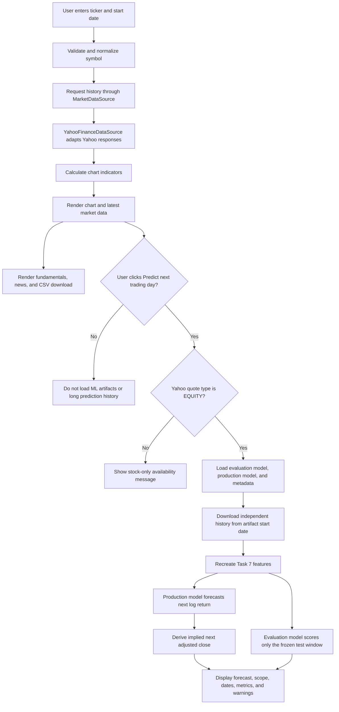

# Financial Dashboard Application Handover

## 1. Purpose and Current State

This project is a Streamlit financial-market dashboard built around `app.py`. A user enters a Yahoo Finance symbol and receives an interactive view of its recent market data. The dashboard supports stocks, indices, and commodities for the general market-data features. The final development stage added an on-demand machine-learning forecast for symbols that Yahoo Finance classifies as equities.

The dashboard currently provides:

- Yahoo Finance daily price and volume data.
- A configurable market-trend chart.
- Optional volume and 50-day/200-day moving-average overlays.
- Latest open, high, low, return, volume, moving-average, and RSI values.
- Company fundamentals when Yahoo provides them.
- The latest relevant Yahoo Finance news.
- A persistent local watchlist.
- CSV download of the currently displayed market data.
- An experimental next-trading-session log-return forecast for stocks.
- Structured JSON logging for Yahoo, watchlist, and ML failures.
- A reusable market-data interface with Yahoo Finance as the default provider.

The ML feature predicts a return directly. The displayed next adjusted close is reconstructed from that predicted return and is not the model's fitted target.

## 2. Development Overview

The application was developed incrementally rather than as one large build.

### Initial dashboard

The first version established the Streamlit page, accepted a ticker and start date, downloaded data from Yahoo Finance, and displayed a basic market chart.

### Dashboard and chart improvements

The market view was progressively improved to include:

- A clearer market title, exchange label, and ticker identity.
- Consistent green, red, and neutral colours based on the latest daily return.
- A dedicated `MarketTrendChart` class that builds the chart one layer at a time.
- Optional volume bars on a secondary axis.
- Optional 50-day and 200-day moving-average lines.
- A categorical x-axis containing only observed trading dates. This removes visual gaps for weekends and market holidays.
- A hidden 400-calendar-day download lookback so long-window indicators can be calculated correctly even when the user selects a recent chart start date.

### Watchlist and navigation

A local SQLite watchlist was added using `.watchlist.db`. Tickers retain their order of addition, duplicates are ignored, and saved tickers link back into the dashboard through validated query parameters. Watchlist failures are isolated so they do not stop the main market dashboard from loading.

### Market context

Later development added:

- A latest-market-data summary.
- RSI and moving-average values.
- Company fundamentals with multiple Yahoo metadata fallbacks.
- Dividend-rate estimation when direct metadata is unavailable.
- Safe normalization and rendering of the latest Yahoo Finance news.
- CSV export for the selected visible date range.

### Market-data boundary and operational logging

Yahoo Finance access was later moved behind a `MarketDataSource` protocol. The
dashboard and ML presentation no longer call `yfinance` directly. The default
`YahooFinanceDataSource` implementation owns Yahoo-specific download options,
quote lookup, metadata fallbacks, fundamentals, and news retrieval. This keeps
the rest of the application independent of one provider and gives future data
sources the same small interface to implement.

Structured logging was added at the same boundary and at handled application
failures. Each Streamlit rerun receives a request ID. Log entries are emitted as
JSON with a stable event name and small diagnostic fields such as the ticker,
operation, row count, and error type. The existing friendly Streamlit warnings
remain unchanged; the underlying traceback is written to the application log
for debugging.

### Final ML addition

The final development stage added a ticker-agnostic XGBoost deployment workflow based on the Task 5–7 stock-data project. This work introduced:

- A next-session log-return target.
- Exact reproduction of the Task 6/7 deployment features inside the app.
- A frozen chronological evaluation contract.
- Separate evaluation and production models.
- A genuine leave-one-ticker-out assessment for unseen-stock evidence.
- Clear Streamlit labels and warnings that prevent the implied price from being mistaken for a directly predicted price.

## 3. Application Flow



The prediction history is intentionally independent of the chart's selected start date. Otherwise, choosing a short chart range could remove the warm-up history needed for rolling indicators or the rows needed for the frozen evaluation window.

## 4. Main Files and Responsibilities

| File or directory | Responsibility |
|---|---|
| `app.py` | Main Streamlit orchestration, market-data download, indicators, chart, watchlist, fundamentals, news, and CSV download. |
| `app_logging.py` | JSON log output, one request ID per Streamlit rerun, and stable structured events. |
| `market_data.py` | The reusable `MarketDataSource` protocol and Yahoo history, quote type, identity, fundamentals, and news implementation. |
| `ml_prediction.py` | ML feature contract, feature engineering, return metrics, frozen-window evaluation, price reconstruction, forecast generation, staleness checks, and artifact validation. |
| `ml_prediction_ui.py` | On-demand Yahoo prediction history, stock eligibility checks, cached model loading, and Streamlit presentation of ML outputs and warnings. |
| `model_artifacts/` | Evaluation model, production model, metadata, training universe, and leave-one-ticker-out results. These files form one versioned deployment unit. |
| `tests/test_app.py` | Existing chart, watchlist, market-summary, fundamentals, indicator, news, and download behavior. |
| `tests/test_ml_prediction.py` | Feature formulas, return metrics, price reconstruction, fixed-window behavior, scope labels, staleness, and artifact consistency. |
| `tests/test_ml_app.py` | Prediction data loading, equity eligibility, lazy loading, UI labels, warnings, and insufficient-history behavior. |
| `tests/test_market_data.py` | Provider compatibility, Yahoo request normalization, quote-type fallback, and fundamentals fallback behavior. |
| `tests/test_app_logging.py` | JSON structure, request IDs, handler configuration, and handled dashboard/ML failure logging. |
| `stock_data_project/Task 6/` | Task 5 data download and Task 6 cleaning/feature-engineering notebooks and outputs. |
| `stock_data_project/Task 7/` | Research comparison, unique-date tuning, unseen-ticker assessment, production fitting, and artifact-export workflow. |

`stock_data_project/` is intentionally excluded by the current `.gitignore`. Its notebooks and generated research outputs exist locally but are not part of the dashboard Git commits unless that policy is changed deliberately.

### Market-data interface

`MarketDataSource` is a Python `Protocol`. It is an interface rather than a
base class, so an alternative provider does not need to inherit from the Yahoo
implementation. It only needs to provide these methods:

```python
history(ticker, *, start_date=None, period=None)
quote_type(ticker)
market_details(ticker)
fundamentals(ticker)
news(ticker, *, count=12)
```

`YahooFinanceDataSource` is the current implementation. It validates ticker
symbols at the boundary, normalizes them once, converts Yahoo results to stable
return types, and records provider failures before using the existing
fallbacks. `app.py` and `ml_prediction_ui.py` depend on the protocol and use the
shared default source. A future source can therefore be introduced by creating
another class that satisfies the protocol and changing the default source in
`market_data.py`; chart, watchlist, and ML calculation code do not need to be
rewritten.

### Logging and debugging

`app_logging.py` uses only Python's standard `logging` library, so no extra
runtime dependency is required. Log records are written to standard error,
which is collected by Streamlit Community Cloud and most other hosting
platforms.

A typical entry is one JSON object:

```json
{
  "event": "yahoo_history_failed",
  "level": "ERROR",
  "operation": "history",
  "request_id": "d6d2...",
  "ticker": "AAPL"
}
```

The traceback is included for exceptions. Price histories, model inputs,
credentials, tokens, and complete Yahoo payloads are not logged. To investigate
one failed dashboard rerun, filter the host logs by `request_id`. Common events
include:

- `yahoo_history_failed`
- `yahoo_fundamentals_fallback`
- `watchlist_load_failed`, `watchlist_add_failed`, and
  `watchlist_remove_failed`
- `market_history_unavailable` and `market_details_fallback_used`
- `ml_quote_type_unavailable`, `ml_forecast_unavailable`, and
  `ml_forecast_failed`

## 5. What `app.py` Does

### Page and input management

`main()` configures the wide Streamlit page and manages ticker selection from either the sidebar text field or a watchlist query parameter. Tickers are normalized to uppercase and validated before local watchlist writes or URL-based navigation.

The user-selected start date controls only the visible chart and downloadable CSV. The download itself begins 400 calendar days earlier to provide sufficient hidden history for the 200-day moving average and RSI calculation.

### Watchlist

The watchlist is stored in a local SQLite database. It supports:

- Ordered insertion.
- Duplicate prevention.
- Deleting one selected ticker.
- Cached five-day snapshots for price and daily change.
- Clickable ticker links that update the dashboard query parameter.

The database is local to the running application. It is not a shared multi-user or cloud-backed watchlist.

### Market chart

`MarketTrendChart` uses Plotly to build the figure through separate steps:

1. Add the closing-price line.
2. Add volume bars when selected and available.
3. Add moving-average lines when selected and available.
4. Configure the axes, legend, and overlays.

Only Yahoo's observed trading dates are placed on the categorical x-axis. The price line colour reflects the most recent daily return: green for positive, red for negative, and neutral grey when direction is unavailable.

### Latest market data

The dashboard displays the newest available trading day's:

- Open, high, and low.
- Daily percentage return.
- Volume.
- 50-day and 200-day moving averages.
- 14-day RSI.

Missing values are shown explicitly rather than being artificially filled.

### Fundamentals and news

Fundamental data uses Yahoo's detailed information first, followed by independent fallbacks. Only values that are genuinely available are rendered. News items are normalized, limited, deduplicated, and restricted to safe Yahoo Finance article URLs before HTML rendering.

### CSV download

The downloadable CSV contains the market data visible from the user's selected start date through the latest available trading day. It is separate from the longer hidden history used to calculate indicators.

## 6. ML Model Design

### Target

The deployment model predicts the next trading session's log return:

```text
Target_Next_Log_Return = log(Adj Close[t+1] / Adj Close[t])
```

The app reconstructs the display price separately:

```text
Implied next adjusted close = Adj Close[t] * exp(predicted log return)
```

RMSE, R², MAE, and directional accuracy are calculated in log-return space. They are not price-error metrics.

### Deployment features

The 17 model inputs are:

- Raw: `Open`, `High`, `Low`, `Close`, `Adj Close`, and `Volume`.
- Engineered: `Log_Return`, return lags 1/3/5, `Price_Range`, `Volume_Change`, `Volatility_20`, `MA_10_MA_20_Ratio`, `Price_MA_20_Ratio`, `RSI_14`, and `MACD_Histogram`.

`Ticker` is used for grouping and evaluation but is not supplied to the production model. No ticker dummy variables are used, which makes it technically possible to forecast an equity outside the training universe.

### Training universe

The model was developed on 18 large-cap stocks across 11 sectors:

`MSFT`, `NVDA`, `GOOG`, `META`, `AMZN`, `TSLA`, `WMT`, `PG`, `JNJ`, `LLY`, `JPM`, `BRK-B`, `CAT`, `UNP`, `XOM`, `NEE`, `LIN`, and `AMT`.

This is a purposeful sector-stratified project sample, not a statistically representative sample of every listed company.

### Chronological evaluation

The modelling data was split using sorted unique trading dates, not dataframe row positions. All ticker rows belonging to one date remain in the same partition and fold.

- Development end: `2025-06-27`.
- Frozen test start: `2025-06-30`.
- Frozen test end: `2026-08-12`.
- Five training-only validation folds were created from development dates.

This test interval is stored in `metadata.json` and must not be extended when newer Yahoo data becomes available.

### Evaluation and production models

Two model files are required because they have different purposes:

- **Evaluation model:** fitted only through the development end date. It is used for the displayed frozen-window RMSE and R².
- **Production model:** refitted on every usable labelled row through the artifact data end date. It is used only for the current forecast.

Displaying validation metrics from the production model would contaminate the evaluation because that model has already seen the test-period rows.

### Seen and unseen tickers

For a ticker in the 18-stock universe, the app labels the metric as **Seen-ticker temporal test**.

For another equity, the app labels it **Unseen-ticker and future-date test**. The evaluation model is applied only to that ticker's rows within the same frozen future-date window. The app also shows the broader nested leave-one-ticker-out result for context.

The training notebook's leave-one-ticker-out assessment removes each held-out ticker from both fitting and hyperparameter selection, then evaluates that ticker in the later frozen period. This is stronger unseen-ticker evidence than simply omitting ticker dummy variables.

If an unseen ticker lacks at least 60 usable observations in the frozen window, the app still shows the current forecast when possible but does not borrow or display another ticker's RMSE or R² as its own.

## 7. Current Model Results

| Evaluation | Observations | Model RMSE | Model R² | Zero-return RMSE | Zero-return R² |
|---|---:|---:|---:|---:|---:|
| Seen-ticker pooled temporal test | 5,076 | 1.846 pp | -0.0002 | 1.848 pp | -0.0019 |
| Pooled leave-one-ticker-out test | 5,076 | 1.855 pp | -0.0099 | 1.848 pp | -0.0019 |

The leave-one-ticker-out macro-average RMSE is 1.772 pp and macro-average R² is -0.0098.

These results show that the current model has weak predictive performance. In particular, the unseen-ticker pooled model is worse than the zero-return baseline. The feature should therefore remain labelled as experimental, and the app must continue to display the baseline and negative-R² warnings rather than presenting the result as a reliable trading signal.

## 8. ML User Experience and Warnings

The ML artifacts and long history are loaded only after the user clicks **Predict next trading day**. This avoids adding model and network cost to every normal dashboard rerun.

After a successful prediction, the dashboard displays:

- Predicted next log return as a percentage.
- Implied next adjusted close.
- Log-return RMSE and R² when enough frozen-window data exists.
- Zero-return-baseline RMSE and R².
- Seen/unseen evaluation scope.
- Frozen test dates and usable observation count.
- Production training-data end date.
- Training-universe status.

Warnings appear when:

- The model RMSE is not lower than the zero-return baseline.
- R² is negative.
- The artifact is more than 30 days beyond its training-data end date.
- The ticker is outside the 18-stock universe.
- Fixed-window data is insufficient.
- Yahoo cannot confirm the symbol is an equity.

Indices, futures, and commodities can still use the normal dashboard, but the ML button returns a stock-only availability message.

## 9. Artifact Contract

The following files must be deployed together:

- `model_artifacts/xgb_next_log_return_evaluation.json`
- `model_artifacts/xgb_next_log_return_production.json`
- `model_artifacts/metadata.json`
- `model_artifacts/training_universe.csv`
- `model_artifacts/unseen_ticker_evaluation.csv`

At load time, the app checks:

- Schema version.
- Feature names and order.
- Target name.
- Chronological boundary ordering.
- Training-universe consistency.
- Coverage and observation count of the unseen-ticker evaluation.
- Exact XGBoost version compatibility.

The current artifact requires XGBoost `2.1.4`. Replacing only one file can break the contract or, worse, mix metrics from one training run with models from another. Always replace the whole artifact set atomically after retraining.

## 10. Running and Testing

Install the runtime dependencies:

```bash
python -m pip install -r requirements.txt
```

Run the dashboard:

```bash
streamlit run app.py
```

Run the tracked tests:

```bash
python -m unittest discover -s tests -v
```

Run static checks when Ruff is available:

```bash
ruff check app.py app_logging.py market_data.py ml_prediction.py ml_prediction_ui.py tests
python -m compileall -q app.py app_logging.py market_data.py ml_prediction.py ml_prediction_ui.py tests
```

In the development environment used for this handover, the Anaconda interpreter at `/Users/yiyangshen/opt/anaconda3/bin/python` contains the required dashboard packages. The system `python3` may not contain Plotly or the other project dependencies.

## 11. Maintenance Guidance

### Updating the dashboard

- Keep general market-dashboard behavior in `app.py`.
- Keep provider-independent ticker and market-data contracts in `market_data.py`.
- Keep Yahoo-specific calls and response fallbacks inside `YahooFinanceDataSource`.
- Use `log_event()` for handled operational failures instead of silently discarding exceptions.
- Keep model calculations and artifact validation in `ml_prediction.py`.
- Keep Streamlit and Yahoo-specific ML presentation in `ml_prediction_ui.py`.
- Preserve the existing dashboard sections and their graceful fallback behavior when adding new features.

### Retraining the model

1. Rerun the Task 5 data download for the approved universe.
2. Rerun Task 6 cleaning and ticker-by-ticker feature engineering.
3. Rerun Task 7 tuning, frozen temporal evaluation, leave-one-ticker-out evaluation, and production fitting.
4. Review the model against the zero-return baseline.
5. Export a complete new artifact set.
6. Rerun the artifact, ML, dashboard, and rendered Streamlit tests.

If a new frozen test period is created, treat it as a new artifact version and record its boundaries explicitly. Do not silently add post-deployment rows to the current `2025-06-30`–`2026-08-12` test metrics.

### Future live monitoring

Newer data should be handled as a separately labelled live-monitoring system. A correct monitoring workflow would save each forecast when it is made and later join it to the observed next-session return. Retrospectively predicting every newer row is not equivalent to an untouched deployment record and must not be described as the original test performance.

### Known limitations

- Yahoo Finance availability and schema changes can temporarily affect the dashboard.
- The watchlist is local and is not designed for multiple users or distributed deployment.
- The ML universe is small and large-cap focused.
- No transaction costs, portfolio construction, risk limits, or execution assumptions are modelled.
- The current ML results do not establish economic profitability.
- The model produces a one-session statistical estimate, not financial advice or a guaranteed price target.

## 12. Final Handover Summary

`app.py` is now a full financial-market exploration dashboard with resilient Yahoo data handling, interactive Plotly visualisation, local watchlist management, current market context, fundamentals, news, and data export. External market access is isolated behind `MarketDataSource`, and handled failures produce correlated JSON logs without changing the user-facing fallback behavior. The ML addition remains modular: `app.py` invokes it, `ml_prediction_ui.py` manages the on-demand user experience, and `ml_prediction.py` owns the mathematical and artifact contracts.

The most important maintenance principle is to keep forecasting and evaluation separate. The production model may use the latest labelled training data, but displayed RMSE and R² must continue to come from the evaluation model and the immutable frozen test window. The current weak results and baseline comparisons should remain visible so future users are not given overstated confidence in the forecast.
